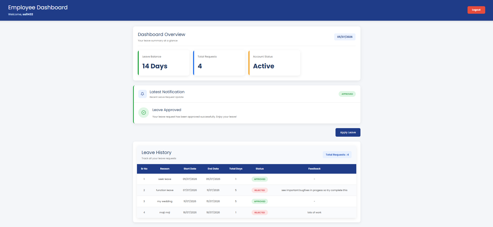
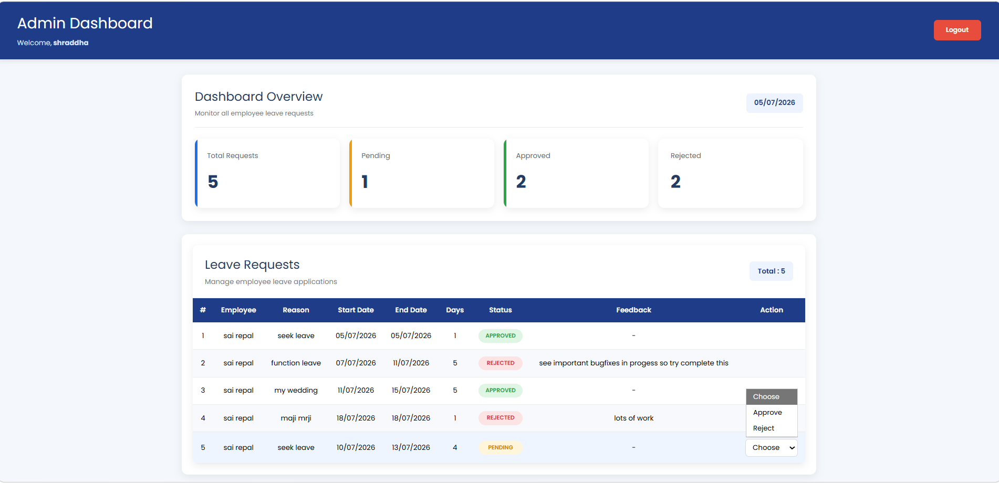
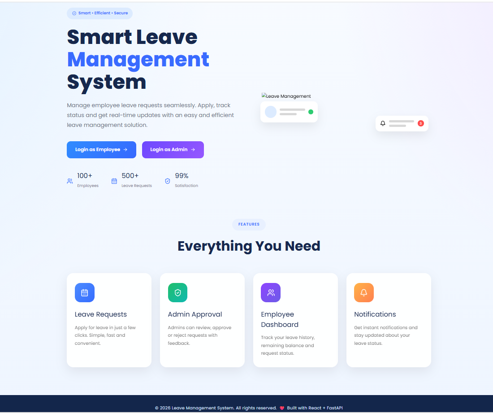
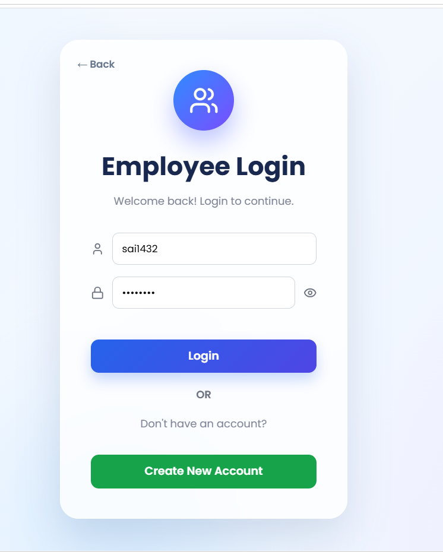
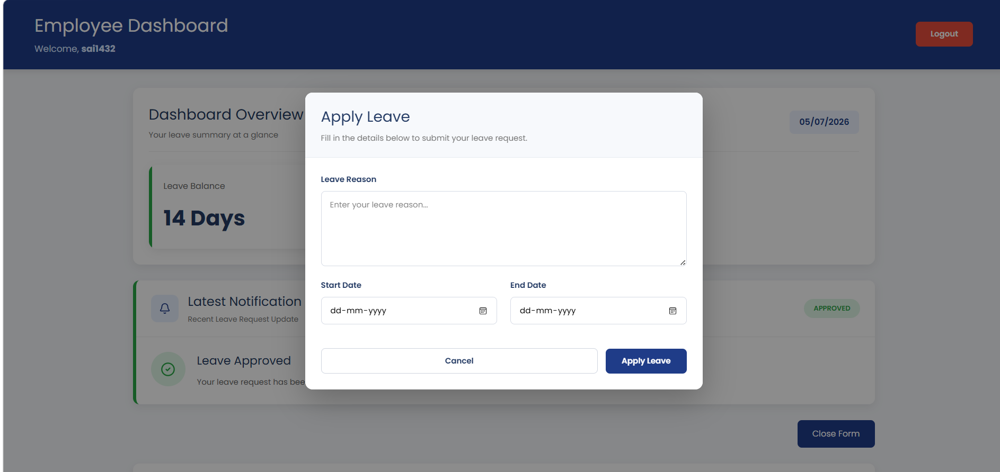
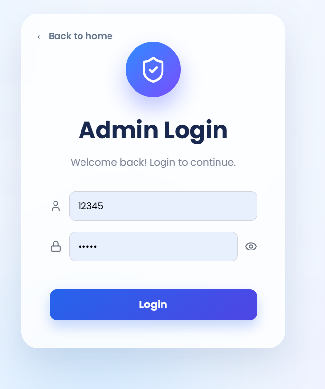

# Leave Management System

A modern Leave Management System developed using the MERN Stack.

The application allows employees to apply for leave and administrators to manage leave requests efficiently.

---

# Project Overview

This project provides a simple and user-friendly leave management workflow.

Employees can:

- Login
- Apply for Leave
- View Leave History
- Track Leave Status
- View Notifications
- Check Leave Balance

Administrators can:

- Login
- View Dashboard
- Approve Leave Requests
- Reject Leave Requests with Feedback
- View Employee Leave Details

---

# Features

## Employee

- Employee Login
- Leave Application
- Leave Balance
- Leave History
- Status Tracking
- Notifications

## Admin

- Admin Login
- Dashboard
- View All Leave Requests
- Approve Requests
- Reject Requests
- Feedback System

---

# Dashboard

Employee Dashboard



Admin Dashboard



---

# Tech Stack

Frontend

- React
- TypeScript
- Tailwind CSS
- Axios
- React Router
- React Toastify

Backend

- Node.js
- Express.js

Database

- MySQL

---

# Architecture

Frontend (React)

↓

REST APIs

↓

Express Server

↓

MySQL Database

---

# Project Structure

```
Frontend
│
├── components
├── pages
├── services
├── styles

Backend
│
├── routes
├── controllers
├── config
├── database
```

---

# Installation

Clone Repository

```bash
git clone <repository-url>
```

Frontend

```bash
cd frontend
npm install
npm run dev
```

Backend

```bash
cd backend
npm install
npm start
```

---

# Environment Variables

Backend

```
PORT=

DB_HOST=

DB_USER=

DB_PASSWORD=

DB_NAME=
```

---

# AI Usage

This project was developed with the help of ChatGPT.

AI assisted in:

- UI Design Improvements
- Tailwind CSS Styling
- Component Refactoring
- Dashboard Design
- Modal Design
- Table Layout Improvements
- Bug Fixing
- Code Optimization

All business logic, API integration, testing, debugging and customization were implemented manually.

---

# Assumptions

- Every employee starts with a fixed leave balance.
- Leave requests remain Pending until admin action.
- Rejected requests include feedback.
- Authentication is role-based.

---

# Future Improvements

- Email Notifications
- Pagination
- Search
- Export Reports
- Calendar View
- Role Based Authentication using JWT
- Leave Cancellation
- Profile Management

---

# Deployment

Frontend

[Deployment Link]

Backend

[Backend Link]

---

# Screenshots


## Home Page



## Employee Login



---

## Employee Dashboard


---

## Apply Leave




---

## Admin Login



---

## Admin Dashboard


---

## Reject Feedback Modal


---

# Demo Video

(Add Google Drive / YouTube Link)

---

# Author

Shraddha
